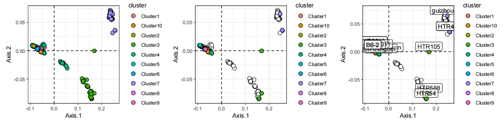

# prs: R package for selecting representative samples

<!-- badges: start -->
<!-- badges: end -->

**PRS** is a population representative selector for picking the reference sample of pangenome projects, which is based on the distance of the different populations.

## Installation

You can install the development version of **prs** like so:

``` r
devtools::install_github("Mengzhuo-Zheng/prs")
```

## Example

- Calculate the score of the samples in different populations

```{r example}
library(prs)
data("dist_matrix")
data("sample_matrix")
samples_score<-prscore(dist_matrix,sample_matrix)
```

- Pick **n** samples for representative of populations from score_matrix

```{r example2}
library(prs)
picked_samples<-prselect(samples_score,3)
```

- Pick **n** samples for representive of populations from distance_matrix
```{r example3}
library(prs)
library(dplyr)
picked_samples<-prscore(dist_matrix,sample_matrix) %>%
  prselect(3)
```

- Visualize the result of representative result of pcoa and/or prselect
```{r example4}
library(prs)
library(dplyr)
library(patchwork)
p1<-prsplot(dist_matrix,sample_matrix,picked_samples)
p2<-prsplot(dist_matrix,sample_matrix,picked_samples,type = "representative",label = FALSE)
p3<-prsplot(dist_matrix,sample_matrix,picked_samples,type = "representative",label = TRUE)
```


## Cite
```
Liao, WW., Asri, M., Ebler, J. et al. A draft human pangenome reference. Nature 617, 312–324 (2023). https://doi.org/10.1038/s41586-023-05896-x
```
